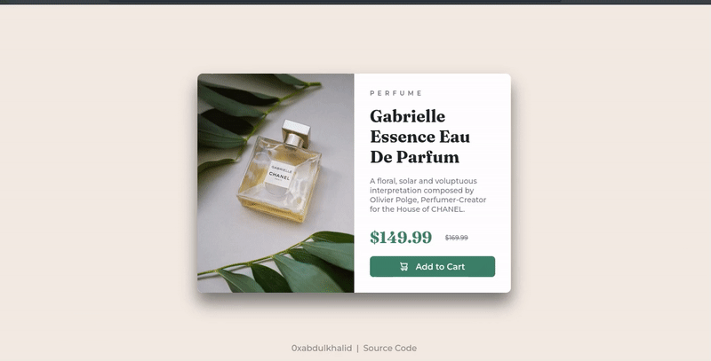

 

# **Product preview card component**

This is a solution to the [Product preview card component challenge on Frontend Mentor](https://www.frontendmentor.io/challenges/product-preview-card-component-GO7UmttRfa).

 

## **Links**

- Solution URL: [click here]()
- Live Site URL: [click here](https://0xabdulkhalid.github.io/product-preview-card-component/)

 

## **Built With**

-    
-    
- 
- 

 

## **Tools Used**

-    
-  
-    

 

## **Outcome**

* Used HTML5 **semantic elements** for better accessability and readability
* Used **ScrollReveal.js** for animations and transitions
* Used **Git** and **GitHub** for project management
* Tried to maintain **clean code**
* Used **media queries** for responsive design
* **Cross tested** on Firefox and Chromium based browsers

 

## **What I learned**

* Learned to use **ScrollReveal.js** library effectively
* Usage of **grid** & **flex** layout's properties in css
* A lot of minor things

 

## **Acknowledgment**

* Challenge by [Frontend Mentor](https://www.frontendmentor.io)
* Thanks to Open source Javascript library [ScrollReveal.js](https://github.com/jlmakes/scrollreveal)

 

## **Contact**

 &nbsp;&nbsp;&nbsp;
  &nbsp;&nbsp;&nbsp;

 
